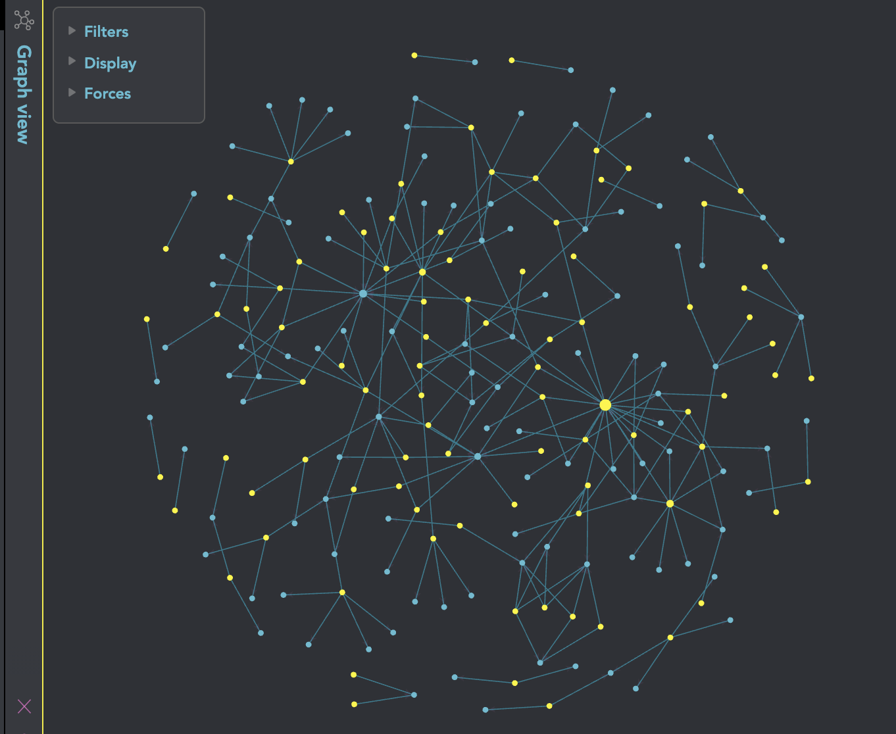

# Obsidian

Obsidian es una app de notas basada en Markdown que trabaja sobre una carpeta local de archivos de texto plano. Permite enlazar notas con `[[wikilinks]]` y visualizar conexiones con un grafo, lo cual encaja muy bien con [[Zettelkasten]].

Referencia:
- https://es.wikipedia.org/wiki/Obsidian_(software)

## Por qué encaja con este repo

- Las notas son archivos `.md` versionables con Git.
- Los enlaces `[[...]]` permiten navegar el conocimiento como red (no solo carpetas).
- Puedes mantener indices por carpeta (los `WH!.md`).

Además, cuenta con 18 plugins o extensiones y sigue creciendo, lo que permite añadir más funcionalidades y adaptar la aplicación a nuestro gusto en poco tiempo. En la próxima versión 1.0 permitirá integrar plugins o extensiones de terceros e incluso construir los tuyos propio.

En resumen, Obsidian es una herramienta gratuita para tomar notas con Markdown, enlazarlas y ver en un gráfico tus pensamientos e ideas, lo que la hace una excelente opción para organizar y estructurar conocimientos de manera efectiva y creativa.

  

## Related

- [[README]]
- [[Zettelkasten]]
