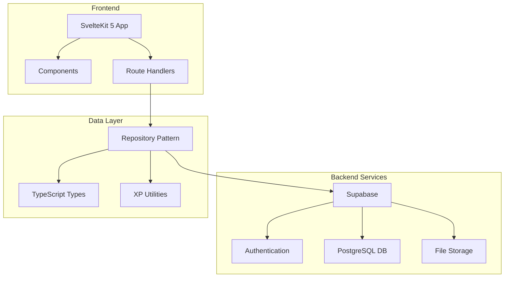

# VitaCora — Personal Productivity Dashboard
## Full Project Specification

---

## Overview

### What is VitaCora?
VitaCora (_'Vita'_ [life] + _'Cora'_ [heart, nucleus] = _VitaCora_ [logbook]) is a comprehensive personal productivity dashboard that transforms daily goal tracking into an engaging, gamified experience. Built as a modern web application, it seamlessly integrates task management, personal development tracking, and relationship building into a unified platform that rewards your progress with experience points and achievements.

### How It Works
VitaCora operates as a centralized life management system where users can track tasks, books, learning goals, memories, and even relationship activities. The platform uses a sophisticated XP (Experience Points) system that awards points for completed activities across different life areas, creating a tangible sense of progress and achievement. All data is securely stored in the cloud with real-time synchronization across devices.

### Why VitaCora?
In today's fragmented digital landscape, managing personal growth across multiple areas of life becomes overwhelming. VitaCora solves this by providing a single, beautifully designed interface that brings together all aspects of personal development while making the journey enjoyable through gamification. The Spanish-language interface reflects its focus on holistic life management, combining productivity with personal well-being.

---

## Product Features

### Core Modules

| Module | Key Features | Benefits |
|--------|--------------|----------|
| **Dashboard** | Global XP level, area progress bars, today's tasks, reading progress | Quick overview of current status and priorities |
| **Visión & Metas** | Vision board, motivational phrases, book tracking, learning journal, memory album, calendar, success experiences, rewards | Comprehensive goal setting and achievement tracking |
| **Trabajo** | Kanban board with drag-and-drop, project management, useful links, skills.md editor | Professional development and task organization |
| **Partner** | Date ideas list, random picker, completion tracking | Relationship building and quality time planning |
| **Perfil & XP** | XP per area, global level, badges/achievements, activity log, export functionality | Progress visualization and achievement celebration |

### Key Capabilities

- **Gamified Progress System**: Earn XP for completing tasks, finishing books, achieving goals, and more
- **Vision Board Integration**: Support for both image URLs and Canva embeds for visual goal setting
- **Multi-Area Tracking**: Education, Work, Self-care, and Social areas with individual XP tracking
- **Achievement System**: Predefined badges that unlock based on user accomplishments
- **Photo Memory Album**: Upload and organize memories with descriptions
- **Skills Registry**: Markdown-based technical skill documentation
- **Calendar Integration**: Track special dates and events

---

## System Architecture

### High-Level Architecture



### Component Structure

The application follows a modular architecture with clear separation of concerns:

- **Repository Pattern**: Centralized data access layer that abstracts Supabase interactions [1](#0-0) 
- **Type Safety**: Comprehensive TypeScript interfaces for all data entities [2](#0-1) 
- **Route-Based Organization**: Each major feature has its own route with dedicated components
- **Shared Components**: Reusable UI elements like Sidebar and WeekPlanner

---

## Tech Stack

### Frontend Technologies

- **Framework**: SvelteKit 5 with Svelte Runes for reactive state management
- **Language**: TypeScript for type safety and better development experience
- **Build Tool**: Vite for fast development and optimized builds
- **Styling**: Custom CSS with CSS variables for theming
- **Deployment**: Node.js adapter for server-side rendering

### Backend & Infrastructure

- **Database**: PostgreSQL via Supabase with Row Level Security (RLS)
- **Authentication**: Supabase Auth with secure session management
- **File Storage**: Supabase Storage for photo uploads
- **API**: Supabase PostgREST for real-time data operations
- **Hosting**: Compatible with VPS, Railway, Render, and other Node.js platforms

### Development Tools

- **Package Manager**: npm
- **Environment**: dotenv for configuration management
- **Migration**: SQL-based database schema management

---

## Data Model

### Core Entities

The application uses a comprehensive data model with the following key tables:

#### Primary Data Tables
- **Tasks**: Kanban board items with status, due dates, and tags [3](#0-2) 
- **Books**: Reading progress tracking with current page, total pages, and notes [4](#0-3) 
- **Projects**: Professional project management with links and descriptions [5](#0-4) 
- **Learning Items**: Educational topics with resources and notes [6](#0-5) 

#### Personal Development Tables
- **Memory Album**: Photo memories with dates and descriptions [7](#0-6) 
- **Success Experiences**: Completed goals with reflections [8](#0-7) 
- **Calendar Events**: Special dates and events tracking [9](#0-8) 
- **Date Ideas**: Relationship activity planning [10](#0-9) 

#### Gamification Tables
- **XP Log**: Detailed experience point tracking with areas and sources [11](#0-10) 
- **Badges**: Achievement definitions with conditions [12](#0-11) 
- **User Badges**: User-specific badge awards [13](#0-12) 

### Security Model

All tables implement Row Level Security (RLS) with policies ensuring users can only access their own data [14](#0-13) .

---

## Gamification System

### XP (Experience Points) Framework

The gamification system is built around a comprehensive XP framework with four distinct life areas:

#### XP Areas
- **Education** (📚): Learning activities, book completion
- **Work** (💼): Task completion, project milestones
- **Self-care** (🌿): Personal well-being activities
- **Social** (💫): Relationship building, social activities

#### XP Awards System

| Activity | XP Awarded | Area |
|----------|------------|------|
| Task completed | 10 XP | Work |
| Book finished | 50 XP | Education |
| Book page update | 2 XP | Education |
| Success experience | 30 XP | Self-care |
| Learning topic added | 15 XP | Education |
| Memory added | 5 XP | Social |
| Reward earned | 20 XP | Self-care |

#### Level Calculation

The system uses a linear progression formula where each level requires 100 XP points [15](#0-14) . Global level is calculated from the sum of all area XP.

### Badge System

Achievements are unlocked through a reactive badge system that evaluates user statistics against predefined conditions:

#### Badge Categories
- **Reading Achievements**: First book, dedicated reader milestones
- **Task Mastery**: Completion streaks and consistency
- **Project Development**: Project creation and management
- **Level Milestones**: Global level achievements
- **Life Areas**: Specific accomplishments in each area

#### Badge Evaluation Process

The badge system runs client-side when users visit their profile page, comparing current statistics against badge conditions and automatically awarding new achievements [16](#0-15) .

---

## Customization

### Visual Customization

- **Theme System**: CSS variables for easy color scheme adjustments
- **Responsive Design**: Mobile-first approach with breakpoints at 900px
- **Language Support**: Spanish-language interface with cultural considerations

### Functional Customization

- **XP Values**: Configurable point awards in the XP utility system
- **Badge Definitions**: Customizable achievement criteria and rewards
- **Date Ideas**: Pre-seeded suggestions that can be customized per user
- **Vision Board**: Support for both image URLs and Canva embeds [17](#0-16) 

### Content Customization

- **Skills Registry**: Markdown-based skill documentation system
- **Useful Links**: Personalized link organization
- **Calendar Events**: Custom special dates and reminders

---

## Glossary

### Core Concepts

- **Bitácora**: The project name, Spanish for "Logbook" or "Journal".
- **XP (Experience Points)**: Primary gamification metric across four life areas
- **Repository Pattern**: Data access abstraction layer for Supabase operations
- **Vision Board**: Visual goal representation supporting images or Canva embeds
- **RLS (Row Level Security)**: Database security model ensuring data isolation

### UI Terminology

| Spanish Term | English Equivalent | Code Reference |
|--------------|-------------------|----------------|
| Trabajo | Work/Kanban | Task management system |
| Visión & Metas | Vision & Goals | Goal setting module |
| Partner | Partner | Relationship activities |
| Perfil & XP | Profile & XP | Progress tracking |
| Hecho | Done | Task completion status |
| Sorpréndeme | Surprise Me | Random date idea picker |

### Technical Terms

- **Runes**: Svelte 5's reactive state management system
- **PostgREST**: Supabase's automatic API generation
- **Storage Bucket**: File upload container for memories
- **Migration**: Database schema definition file

---

## Notes

This specification is based on the current implementation of VitaCora, which is designed as a personal productivity tool with a focus on Spanish-speaking users. The application emphasizes privacy through its RLS implementation and provides a comprehensive gamification system to encourage consistent engagement across all life areas. The modular architecture allows for easy extension and customization while maintaining clean separation between frontend presentation and backend data management.

Wiki pages you might want to explore:
- [Glossary (101rockyprojects/vitacora)](/wiki/101rockyprojects/vitacora#7)

### Citations

**File:** src/lib/services/repository.ts (L27-31)
```typescript
export function createRepository(
  userId?: string,
  client: SupabaseClient<any, any, any> = supabase as SupabaseClient<any, any, any>
) {
  const uid = () => requireUserId(userId);
```

**File:** src/lib/types/index.ts (L1-30)
```typescript
export interface Book {
  id?: string;
  user_id?: string;
  title: string;
  current_page: number;
  total_pages: number;
  notes?: string;
  cover_url?: string;
  created_at?: string;
  updated_at?: string;
}

export interface LearningItem {
  id?: string;
  user_id?: string;
  topic: string;
  resource_link?: string;
  notes?: string;
  image_url?: string;
  created_at?: string;
}

export interface MemoryPhoto {
  id?: string;
  user_id?: string;
  date: string;
  photo_url?: string;
  description: string;
  created_at?: string;
}
```

**File:** supabase/migrations/001_initial.sql (L22-37)
```sql
CREATE TABLE IF NOT EXISTS vitacora.books (
  id          UUID DEFAULT uuid_generate_v4() PRIMARY KEY,
  user_id     UUID REFERENCES auth.users(id) ON DELETE CASCADE NOT NULL,
  title       TEXT NOT NULL,
  current_page INTEGER DEFAULT 0,
  total_pages INTEGER DEFAULT 0,
  notes       TEXT,
  cover_url   TEXT,
  created_at  TIMESTAMPTZ DEFAULT NOW(),
  updated_at  TIMESTAMPTZ DEFAULT NOW()
);
ALTER TABLE vitacora.books ENABLE ROW LEVEL SECURITY;
CREATE POLICY "books_select_own" ON vitacora.books FOR SELECT USING (auth.uid() = user_id);
CREATE POLICY "books_insert_own" ON vitacora.books FOR INSERT WITH CHECK (auth.uid() = user_id);
CREATE POLICY "books_update_own" ON vitacora.books FOR UPDATE USING (auth.uid() = user_id) WITH CHECK (auth.uid() = user_id);
CREATE POLICY "books_delete_own" ON vitacora.books FOR DELETE USING (auth.uid() = user_id);
```

**File:** supabase/migrations/001_initial.sql (L42-55)
```sql
CREATE TABLE IF NOT EXISTS vitacora.learning (
  id            UUID DEFAULT uuid_generate_v4() PRIMARY KEY,
  user_id       UUID REFERENCES auth.users(id) ON DELETE CASCADE NOT NULL,
  topic         TEXT NOT NULL,
  resource_link TEXT,
  notes         TEXT,
  image_url     TEXT,
  created_at    TIMESTAMPTZ DEFAULT NOW()
);
ALTER TABLE vitacora.learning ENABLE ROW LEVEL SECURITY;
CREATE POLICY "learning_select_own" ON vitacora.learning FOR SELECT USING (auth.uid() = user_id);
CREATE POLICY "learning_insert_own" ON vitacora.learning FOR INSERT WITH CHECK (auth.uid() = user_id);
CREATE POLICY "learning_update_own" ON vitacora.learning FOR UPDATE USING (auth.uid() = user_id) WITH CHECK (auth.uid() = user_id);
CREATE POLICY "learning_delete_own" ON vitacora.learning FOR DELETE USING (auth.uid() = user_id);
```

**File:** supabase/migrations/001_initial.sql (L60-72)
```sql
CREATE TABLE IF NOT EXISTS vitacora.memory_album (
  id          UUID DEFAULT uuid_generate_v4() PRIMARY KEY,
  user_id     UUID REFERENCES auth.users(id) ON DELETE CASCADE NOT NULL,
  date        DATE NOT NULL,
  photo_url   TEXT,
  description TEXT NOT NULL,
  created_at  TIMESTAMPTZ DEFAULT NOW()
);
ALTER TABLE vitacora.memory_album ENABLE ROW LEVEL SECURITY;
CREATE POLICY "memory_select_own" ON vitacora.memory_album FOR SELECT USING (auth.uid() = user_id);
CREATE POLICY "memory_insert_own" ON vitacora.memory_album FOR INSERT WITH CHECK (auth.uid() = user_id);
CREATE POLICY "memory_update_own" ON vitacora.memory_album FOR UPDATE USING (auth.uid() = user_id) WITH CHECK (auth.uid() = user_id);
CREATE POLICY "memory_delete_own" ON vitacora.memory_album FOR DELETE USING (auth.uid() = user_id);
```

**File:** supabase/migrations/001_initial.sql (L77-89)
```sql
CREATE TABLE IF NOT EXISTS vitacora.calendar_events (
  id          UUID DEFAULT uuid_generate_v4() PRIMARY KEY,
  user_id     UUID REFERENCES auth.users(id) ON DELETE CASCADE NOT NULL,
  event_name  TEXT NOT NULL,
  event_date  DATE NOT NULL,
  type        TEXT DEFAULT 'event' CHECK (type IN ('special_day','event')),
  created_at  TIMESTAMPTZ DEFAULT NOW()
);
ALTER TABLE vitacora.calendar_events ENABLE ROW LEVEL SECURITY;
CREATE POLICY "calendar_select_own" ON vitacora.calendar_events FOR SELECT USING (auth.uid() = user_id);
CREATE POLICY "calendar_insert_own" ON vitacora.calendar_events FOR INSERT WITH CHECK (auth.uid() = user_id);
CREATE POLICY "calendar_update_own" ON vitacora.calendar_events FOR UPDATE USING (auth.uid() = user_id) WITH CHECK (auth.uid() = user_id);
CREATE POLICY "calendar_delete_own" ON vitacora.calendar_events FOR DELETE USING (auth.uid() = user_id);
```

**File:** supabase/migrations/001_initial.sql (L94-107)
```sql
CREATE TABLE IF NOT EXISTS vitacora.success_experiences (
  id               UUID DEFAULT uuid_generate_v4() PRIMARY KEY,
  user_id          UUID REFERENCES auth.users(id) ON DELETE CASCADE NOT NULL,
  goal_description TEXT NOT NULL,
  completed_date   TIMESTAMPTZ,
  done             BOOLEAN DEFAULT FALSE,
  reflection       TEXT,
  created_at       TIMESTAMPTZ DEFAULT NOW()
);
ALTER TABLE vitacora.success_experiences ENABLE ROW LEVEL SECURITY;
CREATE POLICY "success_select_own" ON vitacora.success_experiences FOR SELECT USING (auth.uid() = user_id);
CREATE POLICY "success_insert_own" ON vitacora.success_experiences FOR INSERT WITH CHECK (auth.uid() = user_id);
CREATE POLICY "success_update_own" ON vitacora.success_experiences FOR UPDATE USING (auth.uid() = user_id) WITH CHECK (auth.uid() = user_id);
CREATE POLICY "success_delete_own" ON vitacora.success_experiences FOR DELETE USING (auth.uid() = user_id);
```

**File:** supabase/migrations/001_initial.sql (L129-144)
```sql
CREATE TABLE IF NOT EXISTS vitacora.tasks (
  id          UUID DEFAULT uuid_generate_v4() PRIMARY KEY,
  user_id     UUID REFERENCES auth.users(id) ON DELETE CASCADE NOT NULL,
  title       TEXT NOT NULL,
  description TEXT,
  status      TEXT DEFAULT 'to_do' CHECK (status IN ('to_do','doing','done','to_review')),
  due_date    DATE,
  tags        TEXT[],
  created_at  TIMESTAMPTZ DEFAULT NOW(),
  updated_at  TIMESTAMPTZ DEFAULT NOW()
);
ALTER TABLE vitacora.tasks ENABLE ROW LEVEL SECURITY;
CREATE POLICY "tasks_select_own" ON vitacora.tasks FOR SELECT USING (auth.uid() = user_id);
CREATE POLICY "tasks_insert_own" ON vitacora.tasks FOR INSERT WITH CHECK (auth.uid() = user_id);
CREATE POLICY "tasks_update_own" ON vitacora.tasks FOR UPDATE USING (auth.uid() = user_id) WITH CHECK (auth.uid() = user_id);
CREATE POLICY "tasks_delete_own" ON vitacora.tasks FOR DELETE USING (auth.uid() = user_id);
```

**File:** supabase/migrations/001_initial.sql (L149-163)
```sql
CREATE TABLE IF NOT EXISTS vitacora.projects (
  id               UUID DEFAULT uuid_generate_v4() PRIMARY KEY,
  user_id          UUID REFERENCES auth.users(id) ON DELETE CASCADE NOT NULL,
  name             TEXT NOT NULL,
  description      TEXT,
  inspiration_link TEXT,
  github_link      TEXT,
  deploy_link      TEXT,
  created_at       TIMESTAMPTZ DEFAULT NOW()
);
ALTER TABLE vitacora.projects ENABLE ROW LEVEL SECURITY;
CREATE POLICY "projects_select_own" ON vitacora.projects FOR SELECT USING (auth.uid() = user_id);
CREATE POLICY "projects_insert_own" ON vitacora.projects FOR INSERT WITH CHECK (auth.uid() = user_id);
CREATE POLICY "projects_update_own" ON vitacora.projects FOR UPDATE USING (auth.uid() = user_id) WITH CHECK (auth.uid() = user_id);
CREATE POLICY "projects_delete_own" ON vitacora.projects FOR DELETE USING (auth.uid() = user_id);
```

**File:** supabase/migrations/001_initial.sql (L200-212)
```sql
CREATE TABLE IF NOT EXISTS vitacora.date_ideas (
  id         UUID DEFAULT uuid_generate_v4() PRIMARY KEY,
  user_id    UUID REFERENCES auth.users(id) ON DELETE CASCADE NOT NULL,
  idea_text  TEXT NOT NULL,
  status     TEXT DEFAULT 'pending' CHECK (status IN ('pending','done')),
  link       TEXT,
  created_at TIMESTAMPTZ DEFAULT NOW()
);
ALTER TABLE vitacora.date_ideas ENABLE ROW LEVEL SECURITY;
CREATE POLICY "date_ideas_select_own" ON vitacora.date_ideas FOR SELECT USING (auth.uid() = user_id);
CREATE POLICY "date_ideas_insert_own" ON vitacora.date_ideas FOR INSERT WITH CHECK (auth.uid() = user_id);
CREATE POLICY "date_ideas_update_own" ON vitacora.date_ideas FOR UPDATE USING (auth.uid() = user_id) WITH CHECK (auth.uid() = user_id);
CREATE POLICY "date_ideas_delete_own" ON vitacora.date_ideas FOR DELETE USING (auth.uid() = user_id);
```

**File:** supabase/migrations/001_initial.sql (L217-230)
```sql
CREATE TABLE IF NOT EXISTS vitacora.xp_log (
  id          UUID DEFAULT uuid_generate_v4() PRIMARY KEY,
  user_id     UUID REFERENCES auth.users(id) ON DELETE CASCADE NOT NULL,
  source_type TEXT NOT NULL,
  source_id   UUID,
  xp_gained   INTEGER NOT NULL DEFAULT 0,
  area        TEXT NOT NULL DEFAULT 'general',
  date        TIMESTAMPTZ DEFAULT NOW()
);
ALTER TABLE vitacora.xp_log ENABLE ROW LEVEL SECURITY;
CREATE POLICY "xp_select_own" ON vitacora.xp_log FOR SELECT USING (auth.uid() = user_id);
CREATE POLICY "xp_insert_own" ON vitacora.xp_log FOR INSERT WITH CHECK (auth.uid() = user_id);
CREATE POLICY "xp_update_own" ON vitacora.xp_log FOR UPDATE USING (auth.uid() = user_id) WITH CHECK (auth.uid() = user_id);
CREATE POLICY "xp_delete_own" ON vitacora.xp_log FOR DELETE USING (auth.uid() = user_id);
```

**File:** supabase/migrations/001_initial.sql (L235-246)
```sql
CREATE TABLE IF NOT EXISTS vitacora.badges (
  id              UUID DEFAULT uuid_generate_v4() PRIMARY KEY,
  name            TEXT NOT NULL UNIQUE,
  description     TEXT NOT NULL,
  icon            TEXT DEFAULT '🏅',
  condition_type  TEXT NOT NULL,
  condition_value INTEGER NOT NULL DEFAULT 1
);
-- Badges are public readable (no RLS needed for reads)
ALTER TABLE vitacora.badges ENABLE ROW LEVEL SECURITY;
CREATE POLICY "badges_read" ON vitacora.badges FOR SELECT USING (true);
CREATE POLICY "badges_insert" ON vitacora.badges FOR INSERT WITH CHECK (true);
```

**File:** supabase/migrations/001_initial.sql (L251-262)
```sql
CREATE TABLE IF NOT EXISTS vitacora.user_badges (
  id         UUID DEFAULT uuid_generate_v4() PRIMARY KEY,
  user_id    UUID REFERENCES auth.users(id) ON DELETE CASCADE NOT NULL,
  badge_id   UUID REFERENCES vitacora.badges(id) ON DELETE CASCADE NOT NULL,
  awarded_at TIMESTAMPTZ DEFAULT NOW(),
  UNIQUE(user_id, badge_id)
);
ALTER TABLE vitacora.user_badges ENABLE ROW LEVEL SECURITY;
CREATE POLICY "user_badges_select_own" ON vitacora.user_badges FOR SELECT USING (auth.uid() = user_id);
CREATE POLICY "user_badges_insert_own" ON vitacora.user_badges FOR INSERT WITH CHECK (auth.uid() = user_id);
CREATE POLICY "user_badges_update_own" ON vitacora.user_badges FOR UPDATE USING (auth.uid() = user_id) WITH CHECK (auth.uid() = user_id);
CREATE POLICY "user_badges_delete_own" ON vitacora.user_badges FOR DELETE USING (auth.uid() = user_id);
```

**File:** src/routes/profile/+page.svelte (L63-104)
```text
  async function checkBadges() {
    const earnedIds = userBadges.map(ub => ub.badge_id);

    // Ensure badges exist in DB
    const { data: existingBadges } = await repo.badges.list();
    const existingNames = (existingBadges || []).map((b: any) => b.name);

    for (const badge of PREDEFINED_BADGES) {
      if (!existingNames.includes(badge.name)) {
        await repo.badges.insert(badge);
      }
    }

    const { data: allBadges } = await repo.badges.list();
    if (!allBadges) return;

    const globalLvl = levelFromXp(totalXP).level;

    for (const badge of allBadges) {
      if (earnedIds.includes(badge.id)) continue;

      let earned = false;
      const val = badge.condition_value;

      switch (badge.condition_type) {
        case 'books_finished': earned = stats.books_finished >= val; break;
        case 'successes': earned = stats.successes >= val; break;
        case 'tasks_done': earned = stats.tasks_done >= val; break;
        case 'projects': earned = stats.projects >= val; break;
        case 'global_level': earned = globalLvl >= val; break;
        case 'memories': earned = stats.memories >= val; break;
        case 'learning': earned = stats.learning >= val; break;
      }

      if (earned) {
        await repo.userBadges.insert({ badge_id: badge.id });
      }
    }

    const { data: updatedBadges } = await repo.userBadges.list();
    userBadges = updatedBadges || [];
  }
```

**File:** src/routes/goals/+page.svelte (L518-532)
```text
        {#if visionBoardLink?.url}
          {#if visionBoardLink.link_type === 'vision_board_canva'}
            <div class="vb-embed-shell">
              <iframe
                loading="lazy"
                style="position: absolute; width: 100%; height: 100%; top: 0; left: 0; border: none; padding: 0;margin: 0;"
                src={visionBoardLink.url + '?embed'}
                allowfullscreen="allowfullscreen"
                allow="fullscreen"
                title="Vision Board Canva"
              ></iframe>
            </div>
          {:else}
            
          {/if}
```
---
