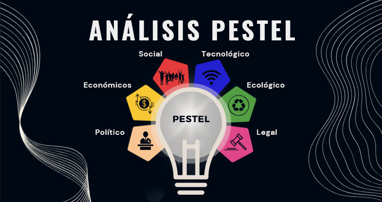

# Cuida
#### Problemática
Actualmente, en la ciudad de Cúcuta, más de 10,000 animales domésticos enfrentan condiciones precarias en las calles, poniendo en riesgo su bienestar y el de la comunidad. 
> De acuerdo con el Censo Antirrábico de la Secretaría de Salud municipal, se estima que en la ciudad hay cerca de 90.000 animales, y de ellos entre un 15 y 20% está en condición de calle, lo que se traduce en más de 10.000 aproximadamente. El 0,1% de esa cifra es el que usted se encuentra mientras camina. [Fuente](https://cucuta.gov.co/el-centro-de-bienestar-animal-de-cucuta-es-una-realidad/)

En Colombia, más de **3 millones de gatos y perros** viven en las calles. La situación es crítica, ya que solo **23 ciudades** tienen algún programa de esterilización. A su vez, existen aproximadamente **2,400 refugios** y hogares temporales que albergan a más de **20,000 animales rescatados**, muchos de ellos sostenidos por mujeres de escasos recursos económicos. [Fuente](https://www.andreapadilla.org/concejalia/plan-de-desarrollo/animales-en-el-pnd/)
El proyecto Cuida nace con el objetivo mejorar la visibilidad, sostenibilidad y eficiencia de los refugios locales a través de una plataforma web centralizada que facilite la adopción, donación y administración de recursos de los refugios locales accesible desde cualquier parte del mundo.
#### Solución Cuida
Plataforma web que ayude a visibilizar a los refugios animales de la ciudad de Cúcuta al recopilarlos en un solo portal donde se muestren sus datos, sus animales, y formas para apoyarlos, además de permitir adoptar y donarles directamente a los refugios animales.

Se busca ayudar a los animales en refugios, abandonados, heridos y en condición de calle a ser tratados con respeto y cariño, controlando las enfermedades y ofreciéndoles una mejor calidad de vida, sea a través de un refugio o en una familia adoptiva. 
#### Estructura
Cuida nace con la idea de ser un medio por el cual los refugios puedan aumentar significativamente el apoyo que reciben de parte de donantes, personas que deseen adoptar o ser voluntarios.

Pretende funcionar a través de dos servicios: el primero, se dedicará a ser el panel administrativo de los refugios que servirá como Back-end de la web, sirviendo como API; el segundo servicio será la web que se comunicará con el primero y consumiendo la información relevante para mostrarla de forma atractiva al público general, es decir, actúa como el Front-end de la aplicación.
> Tecnologías: Typescript | Next.js | Supabase | Postgres | API REST | Docker | Google Cloud.

Al desarrollar la idea, se plantea que Cuida en el futuro tenga como objetivo ser una organización sin fines de lucro u ONG que se encargue de manejar los recursos económicos que se reciban como donativos hacia los refugios y poder gestionarlos de forma equitativa y transparente, para evitar sobrecostos y fallos en logística por parte de refugios cuya infraestructura no cuente con los medios o conocimientos necesarios. 
###### Justificación del Proyecto:
- Existe una necesidad urgente de atender a los animales en situación de calle en Cúcuta.
- Los refugios locales carecen de visibilidad y recursos para hacer frente a esta problemática.
- La comunidad muestra interés y disposición para apoyar la causa animal, pero enfrenta barreras para hacerlo efectivamente.
#### Objetivos del Proyecto:
- Desarrollar una plataforma web que centralice la información de los refugios animales de Cúcuta.
- Aumentar la visibilidad de los refugios y facilitar el proceso de adopción y donación para los usuarios.
- Mejorar la eficiencia en la administración de recursos de los refugios locales a través de un panel de administración.
- Aumentar la tasa de donación y adopción de forma positiva en los refugios locales.
- Fomentar la colaboración con los negocios locales en pro de una causa social y ambiental.
###### Beneficios Esperados:
- Mejora en las condiciones de vida de los animales en situación de calle en Cúcuta.
- Mayor visibilidad y sostenibilidad de los refugios locales.
- Aumento en el número de adopciones y donaciones para los refugios.
- Fortalecimiento de la colaboración entre la comunidad y los negocios locales en torno a la causa animal.
- Contribución al logro de objetivos de desarrollo sostenible relacionados con el bienestar animal y la responsabilidad social.

