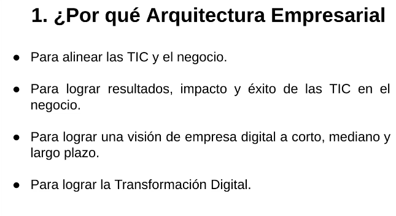
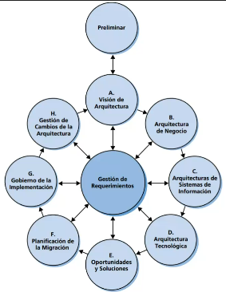
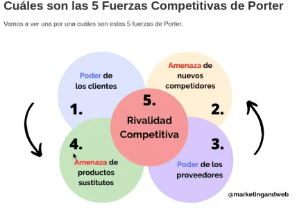

La arquitectura empresarial va más allá de formatos y normativas que generar "burocracia", necesitan de personal capacitado, presupuesto y genera papeleo.
Realmente, se busca hacer un cambio de paradigma e innovar en la empresa, de forma que no se quede en cambios que generan más trabajo sino que agilicen y generen aún más valor.
La tecnología no se vuelve un fin sino un medio, una herramienta que no aporta valor por el hecho de ser novedosa o muy usada en el mercado, sino porque hace que la empresa se desarrolle de una manera más ágil.

Presentación: https://docs.google.com/presentation/d/1z44gyed5nYNCkyJa1k1azYCk5sIXGNX3/edit#slide=id.p1
Drive guía de bolsillo: https://drive.google.com/file/d/1J5GT3Z-OIbEvxODKlg8k150FVyCA5aT-/view

Presentación Pechakucha: https://www.pechakucha.com/