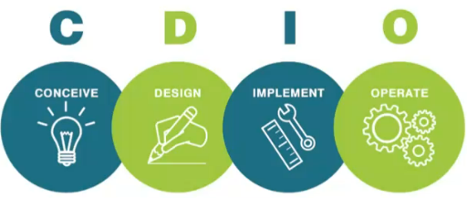

# CDIO

CDIO (Conceive, Design, Implement, Operate) es un enfoque de trabajo muy usado en ingenieria para guiar proyectos desde la idea hasta la operacion.

## Fases

- **Conceive (Concebir)**: problema, usuarios, alcance, restricciones, hipotesis.
- **Design (Disenar)**: arquitectura, decisiones, prototipos, plan.
- **Implement (Implementar)**: construir, probar, integrar, documentar.
- **Operate (Operar)**: desplegar, monitorear, iterar, mejorar.

## Cuándo usarlo

- Proyectos con componente de producto/servicio, donde el "operar" importa tanto como el "construir".
- Para estructurar entregables en equipos: cada fase tiene outputs claros.

## Related

- [[career/minor-project-management/Design Thinking]] (ideacion y exploracion)
- [[career/minor-project-management/DMAIC]] (mejora continua)
- [[career/minor-project-management/Project Charter]] (arranque y alineacion)

