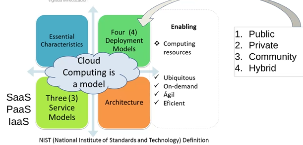
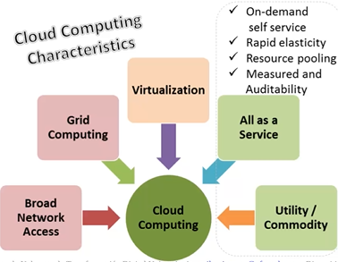
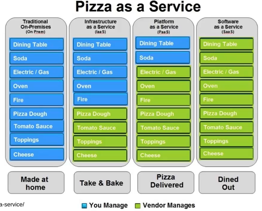
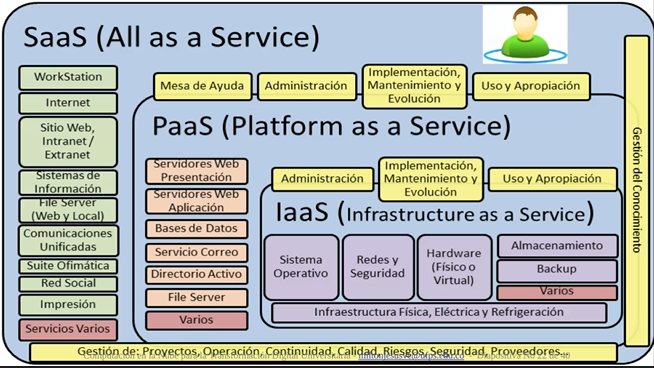
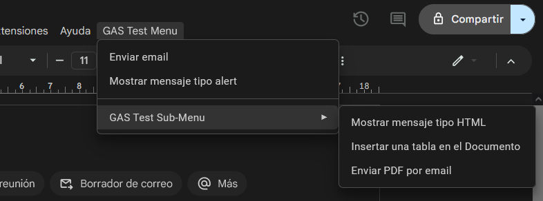
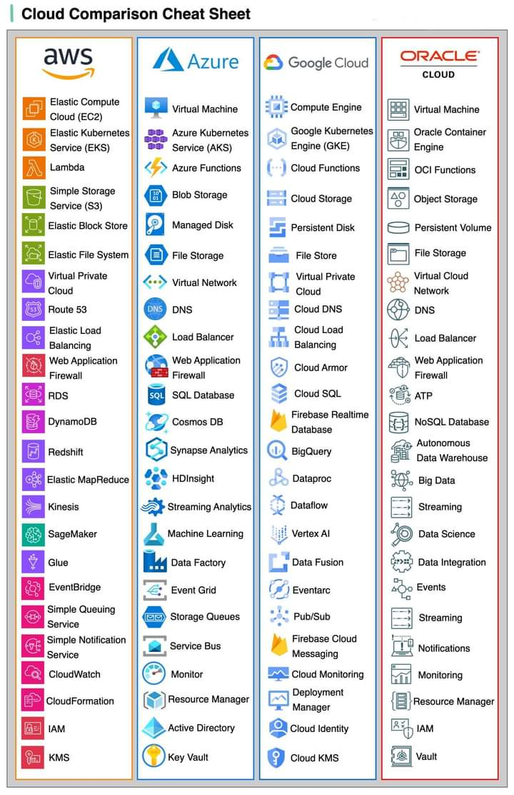
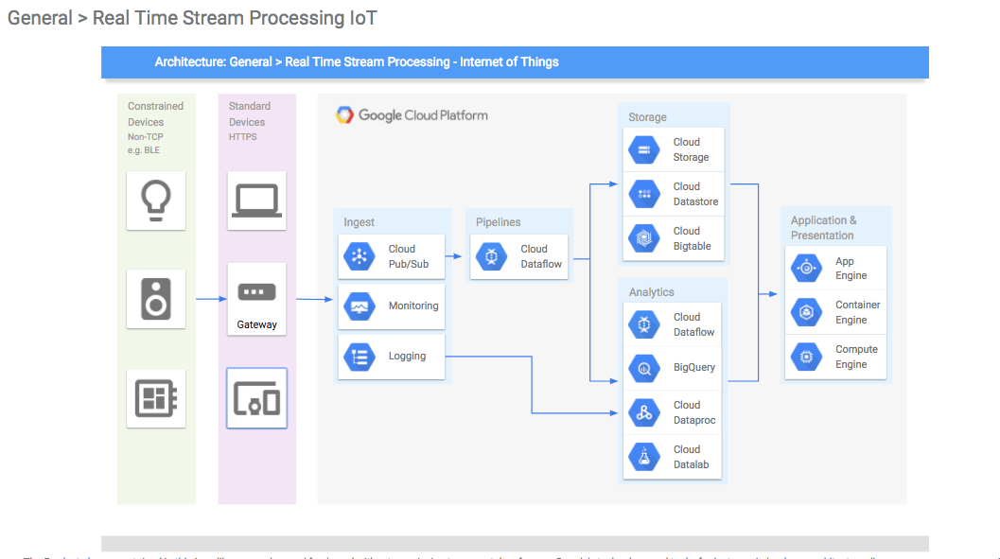

Pago por lo que uso

Ejemplo

Lo que no se ve de un Software (Costos ocultos en amarillo)

Apps Script - Google
https://developers.google.com/apps-script

https://codelabs.developers.google.com/
https://learn.microsoft.com/es-es/office/dev/scripts/

Encuesta: https://codelabs.developers.google.com/codelabs/apps-script-intro?hl=es-419#0
Ejemplos: https://www.youtube.com/playlist?list=PL4-59a5hwQV8pDHHtmr-RER20XT1mvN0t
Documento de Implementación: https://drive.google.com/file/d/1mr7Pzk4m95IJ5xbC7NUmtRyR7ZMzl5AV/view
Projectos: https://richardaanderson.org/project-archives
Email Ingeniero Milton: miltonjesusvc@ufps.edu.co

Clouds:
https://www.heroku.com/
https://aws.amazon.com/es/elasticbeanstalk/
https://stackblitz.com/
https://vercel.com/
https://portal.azure.com/

# Servicios en la Nube

Presentación Servicios de Computación en la nube:
https://docs.google.com/presentation/d/1weIuAYQqueoG_EZtQAKgOXy0IyqdjBUCCcHjiCTVexM/edit?usp=sharing

![Video Computación en la nube][https://www.youtube.com/watch?v=DxBrbL9SvJk&t=3s]

## Servidor Apache -> Nginx
Apache fue el servidor más popular desde los 90.
Java creó Apache Tomcat en base a Apache.
Nginx es reciente, el servidor por excelencia, creada por un ruso, la idea es un servidor moderno, rápido y seguro.

## Snapshots
Son fragmentos o instanténeas que se realizan a las máquinas virtuales, de forma que puedo programar hacer snapshots continuamente, lo que me sirve como Backup.

## Arquitecture Diagram
Los servicios tienen su propio diagrama que permite ver cómo funciona internamente. A continuación se muestra el de Google Cloud:

Videos Instructivos
![][https://www.youtube.com/watch?v=fI6J-HPnjPw&list=PLhy9REXgL_jZPXe7d9pzvmx9IItnwJvBG]

# Crear una aplicación con IA
Genexus: https://www.genexus.com/es/