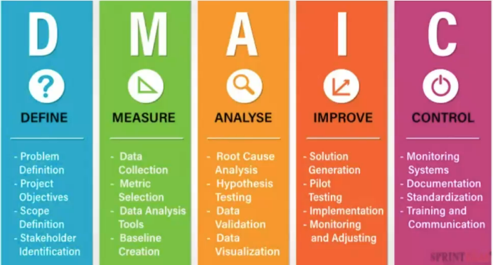

# DMAIC

DMAIC es un metodo de mejora continua (muy asociado a Six Sigma) para optimizar procesos existentes con un enfoque basado en datos.

## Fases

- **Define**: problema, objetivos, alcance, stakeholders.
- **Measure**: medir la situacion actual, recolectar datos, metricas.
- **Analyze**: encontrar causas raiz (no solo sintomas).
- **Improve**: disenar e implementar mejoras.
- **Control**: asegurar que se mantiene la mejora (monitoreo, estandarizacion).

## Cuándo usarlo

- Cuando ya existe un proceso y quieres reducir variacion, errores o tiempos.
- Cuando hay fricciones repetidas y necesitas una forma ordenada de atacar la causa raiz.

## Related

- [[career/minor-project-management/Project Charter]]
- [[career/minor-project-management/PESTEL]] (contexto externo antes de definir cambios)

