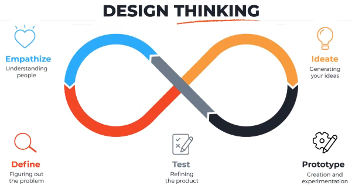
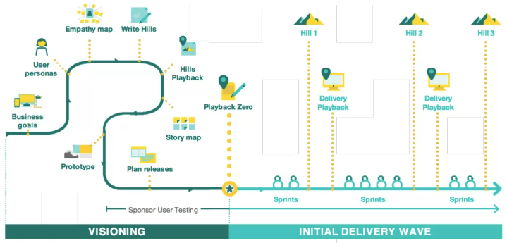

## ¿Qué es?
Metodología de desarrollo, sea de software, hardware, productos, servicios, eventos o procesos.
Similar a Kanban o [[CDIO]].

### Empatizar
Actividad clave, pues con esta partimos de un problema o una necesidad, empatizar significa ver el panorama desde las expectativas y los dolores del usuario.
### Definir
### Idear
### Prototipar
### Probar

##### Recursos
![Recurso][https://www.youtube.com/watch?v=bpVzgW8TUQ0&list=PLSbuwvHoXIcPuFJiXzIpHM3nt2QBWdaNx]

[Según Harvard](https://hbr.org/2008/06/design-thinking)
[Documento](https://readings.design/PDF/Tim%20Brown,%20Design%20Thinking.pdf)
[Manual del emprendedor](https://drive.google.com/file/d/1WvDf636kFwSkPQFROx0CUjJAD5t3eitE/view)
[Marco de trabajo de IBM](https://www.researchgate.net/publication/308995849_IBM_Design_Thinking_Software_Development_Framework)

