###### Profesora: Claudia Yamile Gomez Llanez

Gestión Estratégica y Gobierno TI
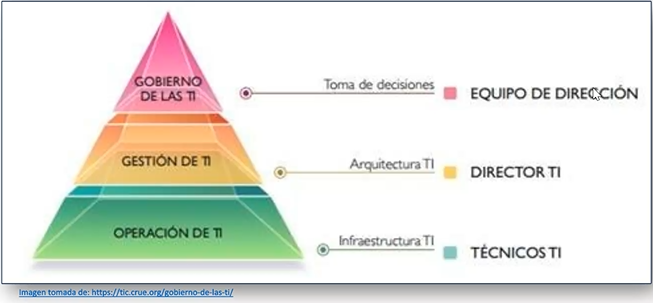

#### Introducción al Gobierno de TI
Recurso:
![][https://www.youtube.com/watch?v=qqmVTuTBNA4]

Ordenadas y preparadas para la eficiencia del modelo de negocio, serie de medidas para tomar decisiones.
Facilita a los comités de dirección en la toma de decisiones según casos de uso y casos de éxito.
Control de la inversión, retorno de inversión, riesgos.
Cercanía de equipo informático con las demás ramas.
El proyecto de gobierno de TI es propio de cada empresa.
Análisis de madurez, estándares (ISO 38500), Roadmap de evolución, imagen de la empresa y apoyarse en tecnología.
Ideas:
1. Facilitar la implementación de tecnología en la empresa.
2. Primeros pasos hacia la evolución vertical de la empresa.
3. Definición de la visión general del estado de la empresa y el alcance al que puede llegar.
4. Jerarquía de roles dentro de la organización.
5. Matriz RACI: Responsabilidad, autoridad, información y colaboración.

##### Misión:
- Proveer servicios al negocio
- Servicios de calidad: Disponibles y funcionales
- Servicios con agilidad: Plazos, Time to Market (TTM)
- Servicios con eficiencia: Costes y Esfuerzo
Ejemplo: DevoTeam

###### TI no siempre es lo que parece
Complejo
Fracasos frecuentes
Negocio insatisfecho
Mucho esfuerzo interno
Personal muy tensionado
Genera malos resultados

##### Actividades del Rol de TI
No se reconocen las actividades ni el esfuerzo.
Hay flujos de actividad:
 - Su descontrol implica caos
 - Controlarlos implica esencia garantizada
 - Hay que tener identificados los flujos (prioridad)
 - Planes preventivos y buenas prácticas
 - No todo está hecho
###### Flujos
- Creación y Evolución
- Soporte preventivo
- Soporte correctivo
- Reprocesos (operaciones repetitivas | Formatos)
- Toma de decisiones
- Coordinación interna
- Cambios
- Planificación y presupuesto
#### ¿Qué es gobernar?
Dirigir, administrar y controlar.

En TI, gobernar es asegurar que la función de TI esté alineada con las necesidades y estrategias de la organización.
###### Factores clave de gobierno:
- Políticas claras, cierre de brecha digital e ineficiencia en tiempo y recursos.
- Tecnológicos: Tener en cuenta la interoperabilidad: datos compartidos, disponibilidad e innovación con componente tecnológicos de todo tipo: Big Data, internet de las cosas, Análisis de datos, Apps.
- Social: Ideas novedosas para prestar servicios pertinentes, eficientes y oportunos.

En TICs, gobernar es asegurar que las tecnologías (bienes y servicios) se utilicen de forma efectiva para realizar los objetivos de forma exitosa.

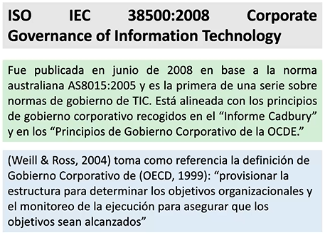
##### Desafíos de TI
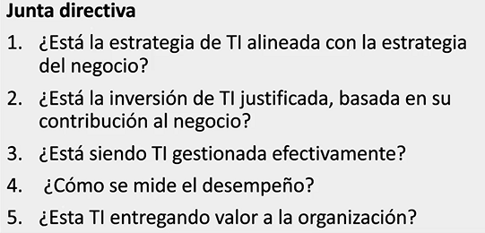
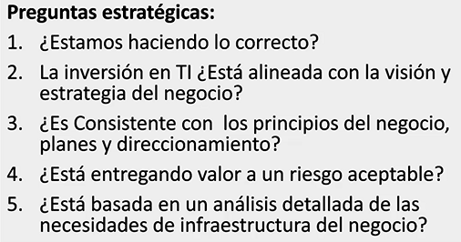
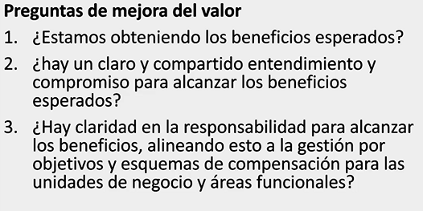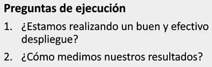
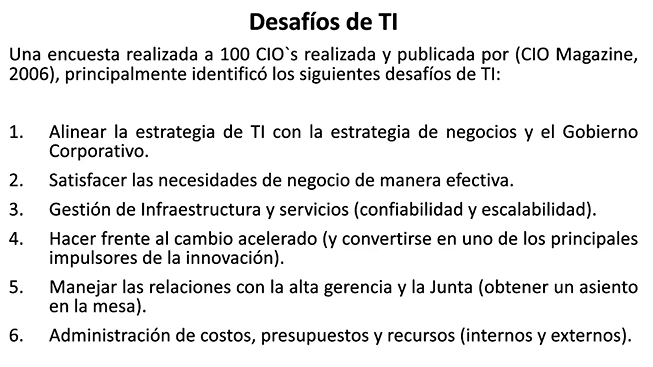

#### Gobierno Corporativo
Junta y dirección ejecutiva -> Gerente general
Armar y aprobar planes y estrategias para controlar recursos y riesgos
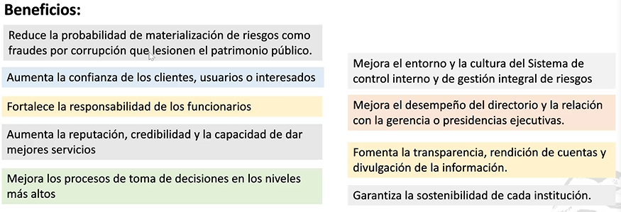
Aquí se definen los objetivos y planes que se desarrollarán en el Gobierno de Negocio.

#### Gobierno de TI
Marco de responsabilidades para fomentar comportamientos y que se alineen a la misión del negocio. Además de agregar valor a la organización, gestionar cambios y riesgos de TI.
###### Pilares:
- Liderazgo, organización y derechos de decisión.
- Procesos flexibles y escalables
- Habilitación de las tecnologías: Canva, Jira, Trello, matriz de riesgos, inventario, indicadores de esfuerzo.

#### Diferencias entre Gobierno Corporativo, Gobierno de Negocio y Gobierno de TI
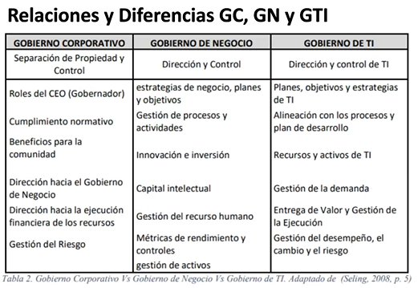

|                          | **Gobierno de Negocio**                                                            | **Gobierno de TI**                                                                                      |
| ------------------------ | ---------------------------------------------------------------------------------- | ------------------------------------------------------------------------------------------------------- |
| **Enfoque**              | Gestión y control general de la organización.                                      | Gestión y control de las tecnologías de la información.                                                 |
| **Objetivo Principal**   | Asegurar que la empresa cumpla sus metas estratégicas y opere eficientemente.      | Asegurar que los recursos tecnológicos apoyen los objetivos empresariales.                              |
| **Componentes Clave**    | - Estrategia - Estructura organizacional - Control interno - Cumplimiento | - Estrategia de TI - Gestión de proyectos - Seguridad de la información - Gestión de servicios |
| **Responsables**         | Alta dirección y consejo de administración.                                        | CIO, CTO y líderes de TI, en colaboración con la alta dirección.                                        |
| **Ámbito de Aplicación** | Toda la organización, incluyendo todas las áreas y procesos.                       | Tecnologías de la información y sistemas relacionados.                                                  |
| **Objetivo Secundario**  | Asegurar la sostenibilidad y el valor a largo plazo de la organización.            | Optimizar el uso de recursos tecnológicos y mitigar riesgos asociados a TI.                             |

#### Siglas de Alta dirección
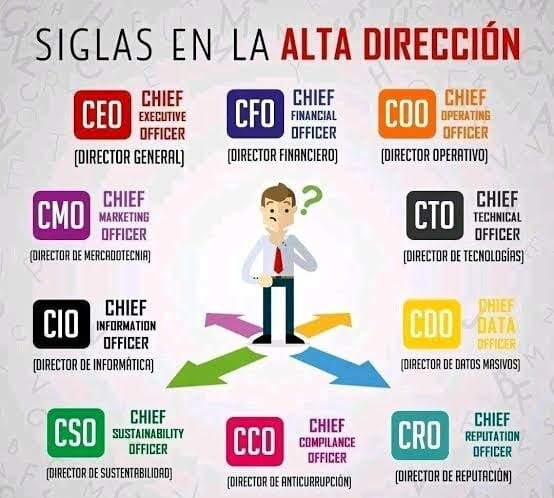

 - CEO (Chief Executive Officer): Es el Consejero Delegado o Director Ejecutivo de una empresa. Este es el máximo responsable de la gestión y dirección administrativa de una organización. El CEO es el pilar de la empresa, ya que es el fundador y quien formula el propósito, la visión y la misión de la compañía, tiene la última palabra en cuanto a decisiones de presupuestos e inversiones y dirige las estrategias de la empresa para que alcance sus objetivos. Este cargo es mejor definido como el “líder” de la empresa.  
  
- COO (Chied Operating Officer): Director de Operaciones, supervisa cómo está funcionando el sistema de creación y distribución de los productos de la empresa, asegurándose de que todos los sistemas funcionen bien.  
  
- CFO (Chief Financial Officer): Director Financiero, se encarga de la planificación económica y financiera de la empresa. Es quien decide la inversión, la financiación y el riesgo con el objetivo de conseguir que aumente el valor de la empresa.  
  
- VP (Vice President): Un vicepresidente es un oficial de una organización que está por debajo de un presidente de rango. Generalmente a cargo de una sección en una organización y reportar a COO.  
  
- CMO (Chief Marketing Officer): Es el Director de Marketing, orientado a la gestión de ventas, al desarrollo de producto, publicidad, estudios de mercado, etc. Su responsabilidad es mantener una relación estable con los clientes finales y comunicarse con todos los demás departamentos para que se involucren en las actividades de Marketing.  
  
- CIO (Chief Information Officer): Es el Director de Informática o de Sistemas. Es el responsable de los sistemas de tecnologías de información de la compañía pero desde el punto de vista de los procesos. El CIO analiza qué beneficios puede sacar la empresa de las nuevas tecnologías, identificar cuales le interesan más a la compañía y evaluar su funcionamiento.  
  
- CTO (Chief Technology Officer): Director de Tecnología encargado de velar que los sistemas de información funcionen adecuadamente. Es el responsable del equipo de ingeniería y de implementar la estrategia técnica para mejorar el producto final.  
  
- CCO (Chief Communications Officer): Es el encargado de manejar la reputación corporativa, contactar con los medios de comunicación y desarrollar las estrategias de branding.

#### Objetivos de Gobierno de TI
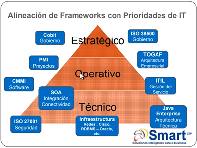
