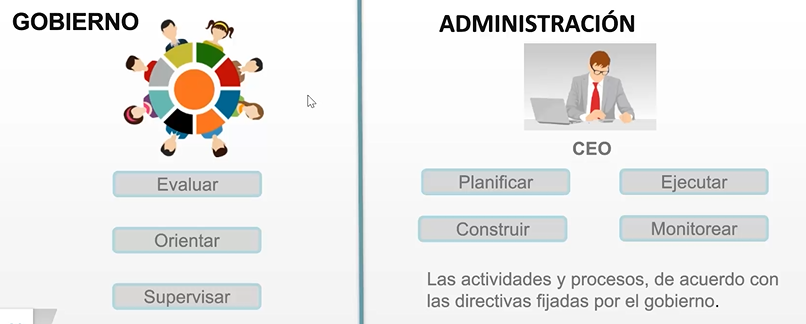
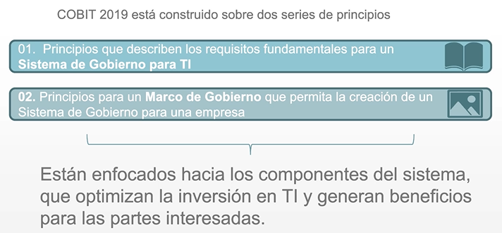
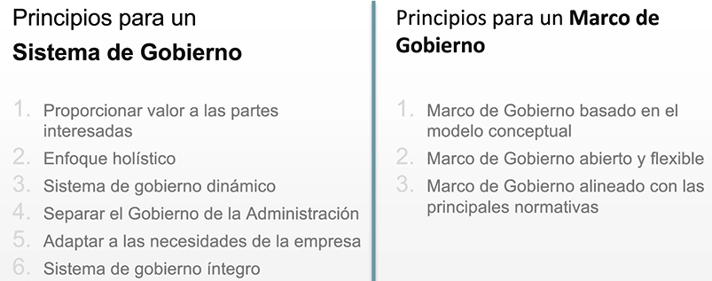

Marco integral de gobierno y administración de TI.
Busca ayudar a la empresa a dirigir la estructura de TI.
Es flexible y adaptable a otros modelos, a pesar de no ser uno como tal.

Define estándares y conductas profesionales para gestionar y controlar los Sistemas de Información con una orientación hacia el negocio.
Crea valor a partir de Tecnologías de Información, Optimización de riesgo y Recursos Informáticos.
A través de un diagnóstico completo:
- Define metas desde la seguridad y control de procesos
- Elabora plan para lograr mejoras necesarias
- Identifica lineamientos
- Define proceso de monitoreo y mejora continua

CREA VALOR -> OPTIMIZAR RIESGO Y RECURSOS

#### Estructura
Gobierno y administración de TI.
Se refiere a todas las tecnologías y procesamiento de información que hace parte de cada proceso de la empresa.

##### Objetivos:
- Entender definiciones y diferencias de Gobierno y Administración
- Reconocer principios
- Identificar componentes
- Describir metas de cascada y su relación con los objetivos
- Describir áreas prioritarias

##### Principios:

##### Componentes: o Habilitadores
- **Principios, Políticas y Marcos:** Son el vehículo para trasladar el comportamiento deseado en guías prácticas para la gestión diaria.
- **Procesos:** Describen un conjunto de prácticas y actividades organizadas para cumplir con ciertos objetivos y producir un conjunto de salidas para alcanzar los objetivos generales relacionados con TI.
- **Estructuras Organizacionales:** Son las entidades claves en la toma de decisiones de la empresa.
- **Cultura, Ética y Comportamiento:** La cultura, ética y comportamiento de los individuos y de la empresa muchas veces son sobrestimados como un factor de éxito en las actividades de gobierno y gestión.
- **Información:** Requerida para mantener la empresa en ejecución y bien gobernada. En el nivel operacional, la información es un producto clave de la empresa.
- **Servicios, Infraestructura y Aplicaciones:** Incluye la infraestructura, la tecnología y las aplicaciones para proveer a la empresa los servicios y procesamiento de Tecnología de la Información.
- **Personas, Habilidades y Competencias:** Requeridas para completar con éxito las actividades y para tomar las decisiones correctas y acciones correctivas.

##### Dominios:
- Evaluar, orientar y supervisar
- Alinear, planear y organizar
- Construir, adquirir e implementar
- Entregar, servir y dar soporte
- Monitorear, evaluar y valorar

#### Áreas prioritarias
- Ciberseguridad
- Transformación digital
- Computación en la nube
- Privacidad
- Pymes
- DevOps

# Marco Paraguas
Recurso:
https://ciberexcelencia.blogspot.com/2021/11/cobit-2019-marco-paraguas-para-el.html
Fácil de acoplar, sistema robusto.
## Principios Fundamentales
COBIT 2019 se basa en varios principios que guían su implementación:
1. **Satisfacer las necesidades de las partes interesadas**: Asegura que las expectativas de todas las partes interesadas sean consideradas y atendidas.
2. **Cubrir la empresa de extremo a extremo**: Aborda todos los aspectos de la organización, no solo los relacionados con TI, promoviendo una visión holística.
3. **Aplicar un marco único e integrado**: Facilita la integración con otros marcos existentes, como ITIL y CMMI, para una gestión más coherente.
4. **Habilitar un enfoque holístico**: Considera todos los factores que afectan el rendimiento de TI, incluyendo personas, procesos y tecnología.
5. **Separar el gobierno de la gestión**: Define claramente las responsabilidades y funciones de gobierno y gestión dentro de la organización.

## Componentes Clave
- **Objetivos de Gobierno y Gestión**: COBIT 2019 establece 40 objetivos que ayudan a las organizaciones a gestionar y gobernar sus recursos de TI de manera efectiva.
- **Facilitadores**: Incluyen políticas, estructuras organizativas, procesos, información y cultura, que son esenciales para el éxito del marco.
- **Áreas de Enfoque**: Permite a las organizaciones adaptar el marco a sus necesidades específicas, facilitando la personalización de la estrategia de gobernanza de TI.

## Proceso de Mejora Continua
COBIT 2019 promueve un ciclo de mejora continua, donde las organizaciones deben:
- **Monitorear**: Evaluar el rendimiento de los procesos y la alineación con los objetivos estratégicos.
- **Evaluar**: Identificar áreas de mejora y ajustar las estrategias según sea necesario.
- **Adaptar**: Implementar cambios para optimizar la gestión de TI y responder a los cambios en el entorno empresarial y tecnológico.

## Beneficios de COBIT 2019
- **Alineación Estratégica**: Facilita la creación de objetivos de TI que estén en sintonía con las metas comerciales.
- **Mejora en la Gestión de Riesgos**: Proporciona herramientas para identificar y gestionar riesgos relacionados con la tecnología.
- **Cumplimiento Normativo**: Ayuda a las organizaciones a cumplir con regulaciones y estándares de la industria.
- **Eficiencia Operativa**: Optimiza los procesos de TI, maximizando el valor y minimizando costos.

## Gobierno de TI
El gobierno de TI se enfoca en asegurar que las TI estén alineadas con los objetivos estratégicos del negocio. Incluye:
- Establecer estructuras organizativas como comités y roles ejecutivos que supervisen la toma de decisiones estratégicas de TI.
- Definir procesos para priorizar y justificar inversiones en TI, así como gestionar los riesgos asociados.
- Establecer métricas para evaluar la efectividad de los procesos de TI y su alineación con los objetivos del negocio.
## Gestión de TI
La gestión de TI, por otro lado, se encarga de la implementación y ejecución de las estrategias de TI definidas por el gobierno. Implica:
- Implementar las políticas y directrices establecidas por el gobierno de TI.
- Gestionar los procesos y recursos de TI a nivel operativo para lograr los objetivos definidos.
- Asegurar que las TI se implementen de manera efectiva y eficiente.

## Separación de Roles y Responsabilidades
Al separar claramente el gobierno de la gestión, COBIT 2019 establece:
- El gobierno define qué se debe hacer, mientras que la gestión se encarga de cómo hacerlo.
- El gobierno supervisa y controla, mientras que la gestión implementa y ejecuta.
- El gobierno establece la dirección estratégica, mientras que la gestión opera dentro de esa dirección.