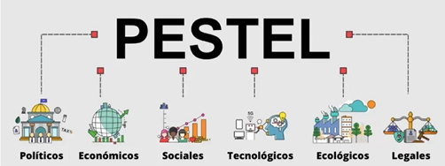
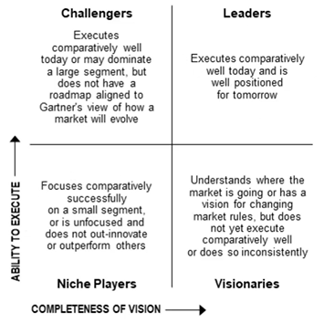
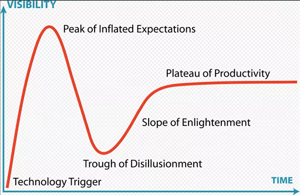
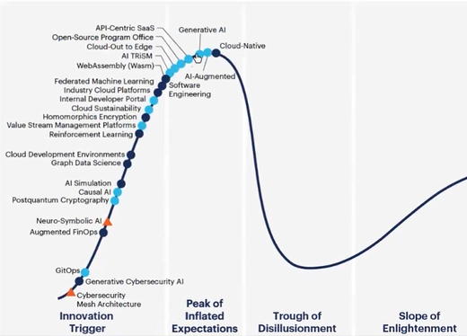

Thinkering
Globalización
Cada iniciativa se puede evaluar desde PESTEL
Los más ricos del mundo lo son, en su mayoría, gracias a la tecnología
Documentos CONPES marcan el camino al futuro de Colombia

Links útiles:
https://solucionesempresariales.trevenque.es/analisis-pestel-que-es-y-para-que-sirve/
https://www.forbes.com/real-time-billionaires/
https://osc.dnp.gov.co/
https://www.dnp.gov.co/conpes/Paginas/buscador-conpes-aprobados.aspx
- https://sisconpes.dnp.gov.co/SisCONPESWeb/ctmp/Borrador_Documento_CONPESIA_comentarios_ciudadan%C3%ADa.pdf
- https://colaboracion.dnp.gov.co/CDT/Conpes/Econ%C3%B3micos/3975.pdf
https://datos.gov.co/
https://www.gartner.com/en/research/methodologies/methodologies
https://www.dane.gov.co/index.php/estadisticas-por-tema

