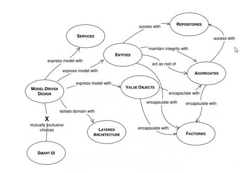

La arquitectura hexagonal, también conocida como **arquitectura de puertos y adaptadores**, es un patrón de diseño de software que busca separar la lógica de negocio de las preocupaciones externas, como la interfaz de usuario y la base de datos. Este enfoque permite que una aplicación funcione de manera independiente de su entorno, facilitando el mantenimiento y la escalabilidad del software. Para lograrlo consta de los siguientes puntos clave:
1. **Separación de Responsabilidades**: La arquitectura hexagonal divide la aplicación en componentes que están débilmente acoplados. Esto significa que cada parte del sistema tiene responsabilidades claramente definidas, lo que facilita su mantenimiento y evolución
2. **Puertos y Adaptadores**: Los **puertos** definen las interfaces que deben implementar los adaptadores, mientras que los **adaptadores** son las implementaciones concretas que conectan la lógica de negocio con el mundo exterior (por ejemplo, APIs, bases de datos, interfaces de usuario). Esta separación permite que se puedan cambiar los adaptadores sin afectar la lógica central de la aplicación.
3. **Capas de la Arquitectura**:
	- **Capa de Dominio**: Contiene la lógica de negocio y debe ser independiente de cualquier tecnología externa.
    - **Capa de Aplicación**: Actúa como intermediaria, coordinando las operaciones entre la capa de dominio y los adaptadores.
    - **Capa de Infraestructura**: Interactúa con el exterior, gestionando la comunicación con bases de datos, servicios externos, y la interfaz de usuario

## Beneficios
- **Desacoplamiento**: Permite que los componentes evolucionen de manera independiente, lo que facilita la implementación de cambios y la integración de nuevas tecnologías sin afectar la lógica de negocio.
- **Facilidad para Realizar Pruebas**: Al tener componentes desacoplados, es más sencillo realizar pruebas unitarias y de integración, ya que cada parte puede ser probada de manera aislada
- **Adaptabilidad**: La arquitectura hexagonal permite que una aplicación sea utilizada a través de diferentes interfaces (como API, consola, etc.) sin necesidad de reescribir la lógica de negocio

## Ejemplo Práctico

Imaginemos que estamos desarrollando una API que necesita acceder a datos de una base de datos. En lugar de que la lógica de negocio dependa directamente de la implementación de la base de datos, se define un puerto que especifica cómo se deben obtener los datos. Luego, se crea un adaptador que implementa este puerto y que se encarga de interactuar con la base de datos. Esto permite que, si en el futuro decidimos cambiar la base de datos o la forma de acceder a ella, solo debamos modificar el adaptador, mientras que la lógica de negocio permanece intacta. En resumen, la arquitectura hexagonal es un enfoque poderoso para el diseño de software que promueve la independencia de componentes y la claridad en la separación de responsabilidades, facilitando así el desarrollo y mantenimiento de aplicaciones complejas.

## **Dominio**
Maneja eventos, no se deben hacer inyecciones dentro del dominio

