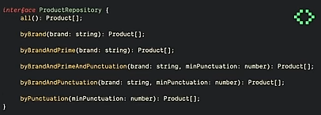
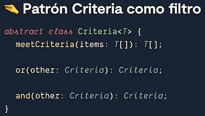
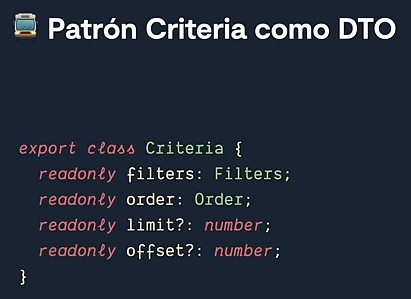
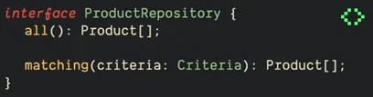

En [diseño de software](https://es.wikipedia.org/wiki/Dise%C3%B1o_de_software "Diseño de software"), el **patrón de especificación** (y en su caso particular, **criteria** o **filter**) es un [patrón de diseño](https://es.wikipedia.org/wiki/Patr%C3%B3n_de_dise%C3%B1o "Patrón de diseño"), mediante el cual, se permite filtrar una colección de objetos bajo diversos criterios, encadenándolos de una manera desacoplada por medio de operaciones lógicas. Este patrón se utiliza en escenarios específicos, donde la obtención de uno o más entidades depende de [reglas de negocio](https://es.wikipedia.org/wiki/Reglas_de_negocio "Reglas de negocio"). Fue creado por Eric Evans y Martin Fowler[1](https://es.wikipedia.org/wiki/Patr%C3%B3n_Criteria_(patr%C3%B3n_de_dise%C3%B1o)#cite_note-1)​

## Propósito

Filtrar colecciones de objetos según diversos criterios de forma desacoplada. Permitir la reutilización y anidación de criterios por medio de operaciones lógicas (and, or, not). Generar una manera legible y extensible de agregar o quitar lógica para filtrar colecciones de objetos.

## Motivación

Frecuentemente, se necesita filtrar colecciones de objetos de la misma familia (clase base) utilizando criterios similares, pero en distinto orden y/o condición. También a menudo, esta lógica para filtrar colecciones es un proceso clave o complejo como pueden ser los criterios de planificación en un [Sistema Operativo](https://es.wikipedia.org/wiki/Sistema_operativo "Sistema operativo") o el manejo de prioridades para una cola de peticiones.

#### Útil como Filtro o como DTO
Imaginemos una interfaz que tiene todas las permutaciones posibles para buscar un producto en Amazon.

Rápidamente esto podrá hacer el código difícil de leer, mantener y de escalar. Esto va en contra del principio Open-Closed de SOLID.
Con Criteria, todo lo que necesitamos es una interfaz tal que así:

![][https://www.youtube.com/watch?v=RKWb3eI4wO4]