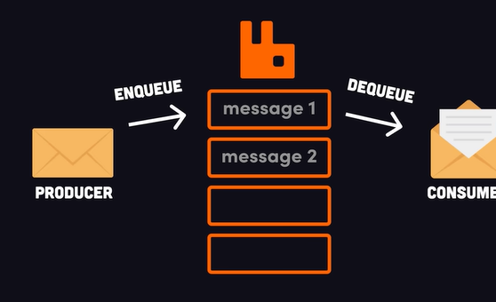
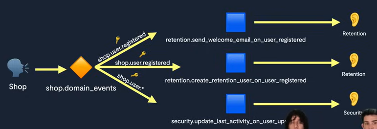

# RabbitMQ

RabbitMQ es un broker de mensajeria (AMQP) usado para comunicar sistemas de forma asincorna mediante colas. Es util para:

- Procesamiento en background.
- Integraciones entre servicios.
- Absorber picos de carga.

Conceptos base:

- **Exchange**: recibe mensajes.
- **Queue**: donde se encolan mensajes para consumo.
- **Binding**: regla que conecta exchange -> queue.
- **Routing key**: "etiqueta" usada para enrutar (segun tipo de exchange).

Entre las formas de enviarlo existe DIRECT (cola específica), TOPICS (grupo de colas con cierto patrón) y FANOUT (todos).

RabbitMQ opta por delegarle más responsabilidades a la parte del Broker (infraestructura), más lógica, que hace que el Consumer (implementación) sea más sencillo de realizar.

Por ejemplo, para enviar un email de bienvenida a un usuario, este sería el paso a paso.

## Buenas practicas rapidas

- Consumidores idempotentes. Ver [[concepts/Idempotencia]].
- Define retries y DLQ (poison messages).
- Observabilidad: correlacion por `messageId` o `correlationId`.

## Related

- [[concepts/Colas]]
- [[concepts/Event Driven]]
